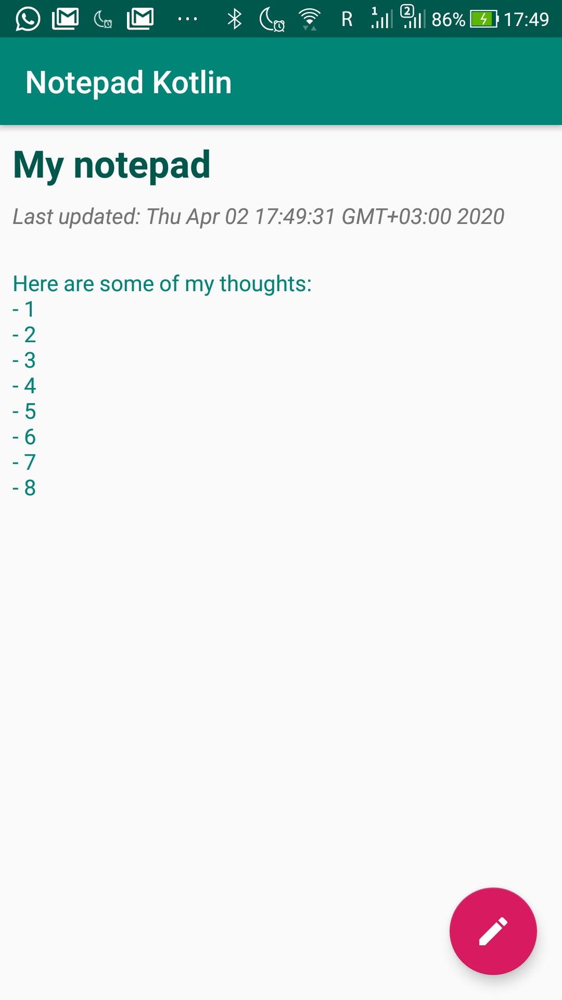
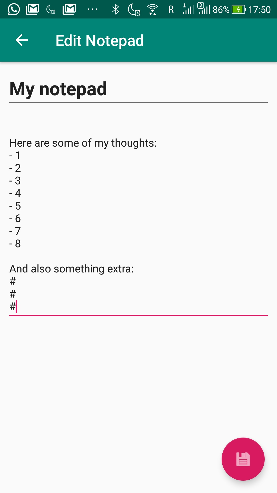

# Level 5 Learning Task 1 - Notepad
This is an app which acts as a notepad in which you write down notes.
## What's inside
The following new subjects were covered in this learning task:
* Architecture Components (ViewModel, LiveData)
* Room type converters
* Room pre-populate database
## Screenshots
    
